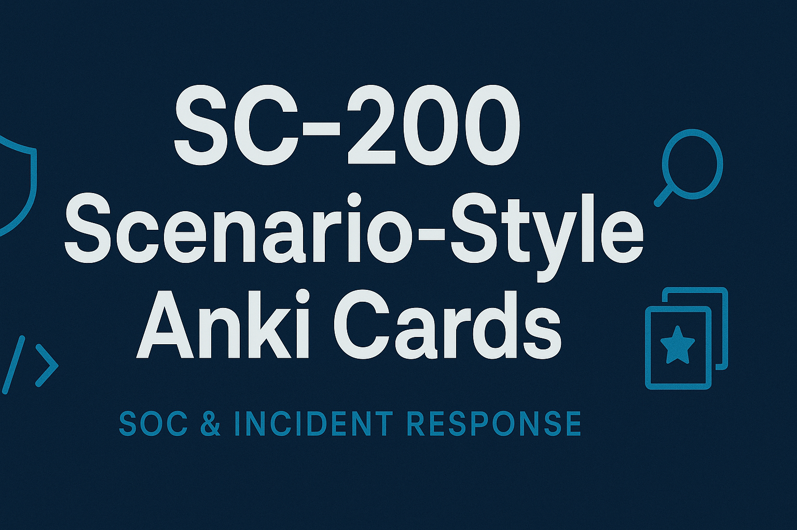

# SC-200 Anki Flashcards

  

Flashcards to help prepare for the **Microsoft SC-200: Security Operations Analyst** exam.  
All cards are provided in **TSV format** (easy to import into Anki).  

---
---

## 📝 Sample Cards

| Front | Back |
|-------|------|
| In Microsoft Sentinel, which KQL operator is used to filter rows based on a condition? | `where` |
| Which Microsoft 365 Defender product is designed to protect endpoint devices? | Microsoft Defender for Endpoint |
| What is the default log retention period in Microsoft Sentinel? | 90 days (configurable) |
| In Defender for Cloud, which feature provides secure score recommendations? | Secure Score |
| During incident response, what step comes immediately after detection? | Containment |

---

## 📂 Flashcard Downloads  
 

---

### 📑 Section Decks — *Best for topic-by-topic study*  
| Section | File | Topics |  
|---------|------|--------|  
| **Sentinel** | [Download](sections/Sentinel.tsv) | SIEM, analytics rules, incidents, hunting |  
| **M365 Defender** | [Download](sections/M365_Defender.tsv) | EDR, investigation, automated response |  
| **Defender for Cloud** | [Download](sections/Defender_for_Cloud.tsv) | Recommendations, Secure Score, compliance |  
| **KQL** | [Download](sections/KQL.tsv) | Queries, operators, joins, filtering, summarization |  
| **SOC & Incident Response** | [Download](sections/SOC_IR.tsv) | Playbooks, automation, incident triage |  

---

### 📝 Exam Packs — *Best for quick knowledge recall*  
| Pack | File | Description |  
|------|------|-------------|  
| **Exam 1** | [Download](exams/Exam1.tsv) | Core SC-200 facts aligned to Microsoft Learn modules |  
| **Exam 2** | [Download](exams/Exam2.tsv) | More practice flashcards for exam prep |  
| **Exam 3** | [Download](exams/Exam3.tsv) | Additional SC-200 coverage |  
| **Combined Pack** | [Download](exams/Exam_Combined.tsv) | All exam packs merged |  

---

### 🎯 Scenario Sets — *Best for exam-style applied practice*  
| Set | File | Focus Areas |  
|-----|------|-------------|  
| **Set 1** | [Download](SC-200_Scenario_Cards_Set1.tsv) | Sentinel incidents, automation, KQL basics, watchlists, Secure Score |  
| **Set 2** | [Download](SC-200_Scenario_Cards_Set2.tsv) | Incident response, UEBA/Fusion ML, advanced automation, threat hunting |  

---

## 🛠 Import Instructions

1. Download one of the `.tsv` sets above.  
2. Open Anki → **File → Import** → select the `.tsv`.  
3. Map fields as: **Front**, **Back**, **Tags**.  
4. Import into your SC-200 deck.

---

---

## 📂 Details of Each Set

### Set 1 – Core Sentinel & KQL Scenarios
- **File:** [`SC-200_Scenario_Cards_Set1.tsv`](tsv/SC-200_Scenario_Cards_Set1.tsv)
- **Topics Covered:**
  - Sentinel incidents, automation rules, data connectors
  - KQL query patterns (extend, joins, outliers)
  - Watchlists, Secure Score, Defender integrations
  - Threat Intel and basic hunting techniques

### Set 2 – Incident Response, UEBA, & Advanced Hunting
- **File:** [`SC-200_Scenario_Cards_Set2.tsv`](tsv/SC-200_Scenario_Cards_Set2.tsv)
- **Topics Covered:**
  - Incident response workflows (isolation, blocking, live response)
  - UEBA, Fusion ML correlation rules
  - Advanced automation with playbooks and external integrations
  - Threat hunting for Kerberos, RDP, persistence, and exfiltration
  - Defender for Endpoint, Defender for Cloud Apps, and Cloud integrations

---

## ✅ Study Recommendations

- Use these cards as **memory anchors**.  
- Pair with:
  - Microsoft Learn SC-200 modules (review twice).    
  - Hands-on Sentinel & Defender labs for applied skills.  

These decks ensure both **fact recall** and **scenario-based reasoning**, closely matching the SC-200 exam format.
## 📖 How to Import into Anki
1. Download the `.tsv` file you want.  
2. In Anki: **File → Import**.  
3. Select the file.  
4. Choose **Tab-separated**, with **Field 1 = Front** and **Field 2 = Back**.  
5. Import → start studying 🚀  

---

## 🔗 Helpful Links
- [Official SC-200 Exam Page](https://learn.microsoft.com/en-us/certifications/exams/sc-200/)  
- [Microsoft Learn SC-200 Study Guide](https://learn.microsoft.com/en-us/training/courses/sc-200t00)  
- [Anki (Download)](https://apps.ankiweb.net/)  
- [Anki Manual](https://docs.ankiweb.net/)  

---

## 🛠 About
This repo contains study flashcards organized into **sections** and **exam-style packs** to match the SC-200 exam structure.  
Contributions and corrections are welcome!  

---

<!--  
## 🚀 Next Steps (Future)
Once `.apkg` exports are ready, we’ll also publish them as GitHub Releases.

1. Export decks from Anki as `.apkg`.  
2. Go to **Releases → Draft a new release**.  
3. Tag a version (e.g., `v1.0.0`) and upload the `.apkg` file(s).  
4. Users can then download and import in one click.  

-->

